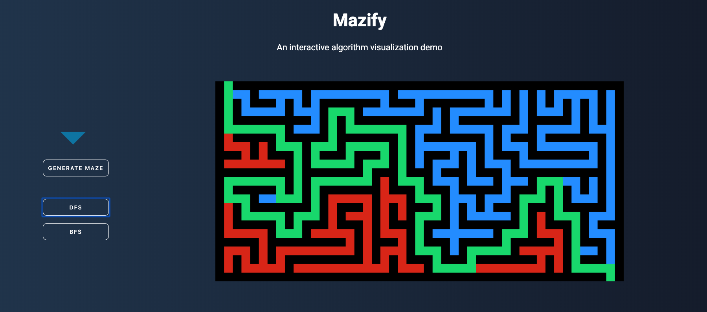

# Mazify
[Live version.](https://ramahar.github.io/Mazify)

Mazify is a Javascript browser application that visualizes maze solving and maze generating algorithms. A random maze is generated and the user can choose which algorithm to run on the maze. Traversal algorithm will then be implemented and visualized solving the maze.


 
## Architecture and Technologies
- Vanilla JavaScript
- Canvas
- HTML5 + CSS3

## Features
- Implementation of graph traversing algorithms (DFS, BFS, Dijkstra etc.)
- Render path-solving algorithm on a randomly generate maze using Canvas
- Dynamically manipulate the DOM using pure Javascript
- Add maze generator to generate new random maze on every click


## Algorithms 
- BFS
- DFS
- A* Search

## Implementation
I used vanilla JS to dynamically manipulate the DOM by using event listeners to render maze-solving algorithms  

```
document.getElementById("dfs")
.addEventListener('click', function () {
	if (!mazeGenerated) return;
	setUp(); 
	searchMazeWithDFS(outsetx, outsety, 20);
});

document.getElementById("bfs")
.addEventListener('click', function () {
	if (!mazeGenerated) return;
	setUp(); 
	searchMazeWithBFS(outsetx, outsety, 25);
});
```



A random maze generating algorithm was implemented to create a new maze with different start and end points every time  

```
function generateMaze(x, y) {
	var doublex = x * 2;
	var doubley = y * 2;
	var phase = (Math.random() > 0.5) ? 1 : 3;

	maze[doublex][doubley] = 0;

	for (var i = 0, step = randint(4) - 1; i < 4; i++, 
			step = (step + phase) % 4) {
		if (doubley + dy[step] - 1 != mazeY
			&& maze[doublex + 2 * dx[step]][doubley + 2 * dy[step]]) {
			maze[doublex + dx[step]][doubley + dy[step]] = 0;
			//Converts maze JS object to JSON string 
			result.push(JSON.stringify(maze));
			generateMaze(x + dx[step], y + dy[step]);
		}
	}
}
```